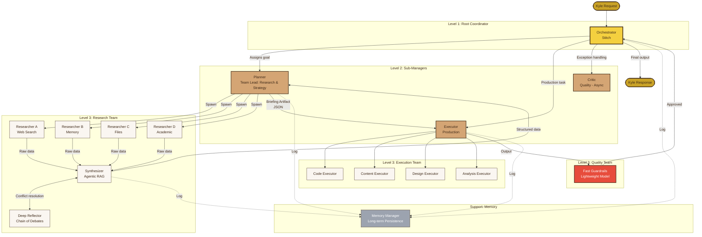
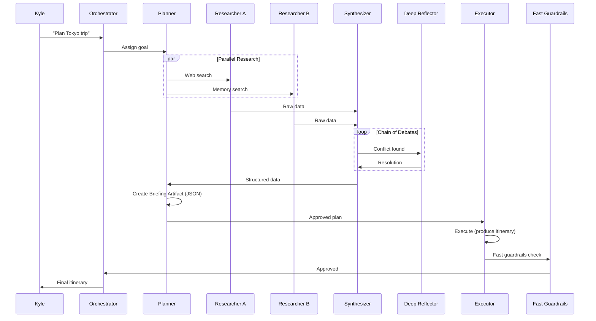
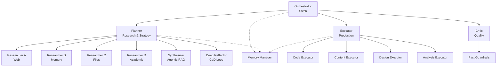
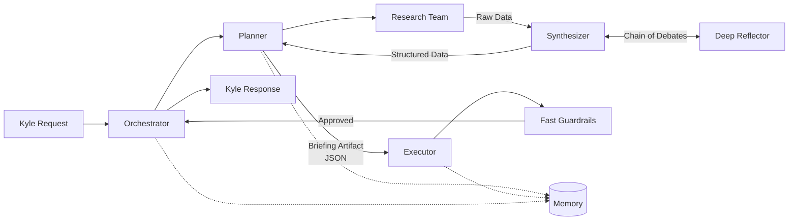

# Stitch Agentic Architecture v2.0 — Mermaid Diagram

## Full System Diagram

```mermaid
graph TB
    subgraph "Level 1: Root Coordinator"
        ORCH[Orchestrator<br/>Stitch]
    end

    subgraph "Level 2: Sub-Managers"
        PLNR[Planner<br/>Team Lead: Research & Strategy]
        EXEC[Executor<br/>Production]
        CRIT[Critic<br/>Quality - Async]
    end

    subgraph "Level 3: Research Team"
        RWEB[Researcher A<br/>Web Search]
        RMEM[Researcher B<br/>Memory]
        RFILE[Researcher C<br/>Files]
        RACAD[Researcher D<br/>Academic]
        SYNTH[Synthesizer<br/>Agentic RAG]
        DREF[Deep Reflector<br/>Chain of Debates]
    end

    subgraph "Level 3: Execution Team"
        ECODE[Code Executor]
        ECONT[Content Executor]
        EDES[Design Executor]
        EANAL[Analysis Executor]
    end

    subgraph "Level 3: Quality Team"
        FG[Fast Guardrails<br/>Lightweight Model]
    end

    subgraph "Support: Memory"
        MEM[Memory Manager<br/>Long-term Persistence]
    end

    %% Flow: Intake
    KYLE([Kyle Request]) --> ORCH

    %% Flow: Level 1 → Level 2
    ORCH -->|"Assigns goal"| PLNR
    ORCH -->|"Production task"| EXEC
    ORCH -->|"Exception handling"| CRIT

    %% Flow: Planner → Research Team
    PLNR -->|"Spawn"| RWEB
    PLNR -->|"Spawn"| RMEM
    PLNR -->|"Spawn"| RFILE
    PLNR -->|"Spawn"| RACAD

    %% Flow: Research → Synthesis
    RWEB -->|"Raw data"| SYNTH
    RMEM -->|"Raw data"| SYNTH
    RFILE -->|"Raw data"| SYNTH
    RACAD -->|"Raw data"| SYNTH

    %% Flow: Chain of Debates
    SYNTH <-->|"Conflict resolution"| DREF

    %% Flow: Synthesis → Context Engineering
    SYNTH -->|"Structured data"| PLNR
    PLNR -->|"Briefing Artifact<br/>JSON"| EXEC

    %% Flow: Execution
    EXEC --> ECODE
    EXEC --> ECONT
    EXEC --> EDES
    EXEC --> EANAL

    %% Flow: Quality Control
    EXEC -->|"Output"| FG
    FG -->|"Approved"| ORCH

    %% Flow: Delivery
    ORCH -->|"Final output"| KYLE2([Kyle Response])

    %% Memory connections
    ORCH -.->|"Log"| MEM
    PLNR -.->|"Log"| MEM
    SYNTH -.->|"Log"| MEM
    EXEC -.->|"Log"| MEM

    %% Styling
    classDef root fill:#f4d03f,stroke:#3d2817,stroke-width:3px,color:#3d2817
    classDef manager fill:#d4a574,stroke:#3d2817,stroke-width:2px,color:#3d2817
    classDef worker fill:#faf6f1,stroke:#3d2817,stroke-width:1px,color:#3d2817
    classDef quality fill:#e74c3c,stroke:#3d2817,stroke-width:2px,color:#fff
    classDef support fill:#9ca3af,stroke:#3d2817,stroke-width:1px,color:#fff
    classDef external fill:#c9a227,stroke:#3d2817,stroke-width:2px,color:#3d2817

    class ORCH root
    class PLNR,EXEC,CRIT manager
    class RWEB,RMEM,RFILE,RACAD,SYNTH,DREF,ECODE,ECONT,EDES,EANAL worker
    class FG quality
    class MEM support
    class KYLE,KYLE2 external
```

## Workflow Sequence Diagram

```mermaid
sequenceDiagram
    participant K as Kyle
    participant O as Orchestrator
    participant P as Planner
    participant R1 as Researcher A
    participant R2 as Researcher B
    participant S as Synthesizer
    participant D as Deep Reflector
    participant E as Executor
    participant F as Fast Guardrails

    K->>O: "Plan Tokyo trip"
    O->>P: Assign goal

    par Parallel Research
        P->>R1: Web search
        P->>R2: Memory search
    end

    R1->>S: Raw data
    R2->>S: Raw data

    loop Chain of Debates
        S->>D: Conflict found
        D->>S: Resolution
    end

    S->>P: Structured data
    P->>P: Create Briefing Artifact (JSON)
    P->>E: Approved plan

    E->>E: Execute (produce itinerary)
    E->>F: Fast guardrails check
    F->>O: Approved
    O->>K: Final itinerary
```

## Hierarchical Structure (Tree View)

```mermaid
graph TD
    ROOT[Orchestrator<br/>Stitch]
    
    ROOT --> PLAN[Planner<br/>Research & Strategy]
    ROOT --> EXEC[Executor<br/>Production]
    ROOT --> CRIT[Critic<br/>Quality]
    
    PLAN --> R1[Researcher A<br/>Web]
    PLAN --> R2[Researcher B<br/>Memory]
    PLAN --> R3[Researcher C<br/>Files]
    PLAN --> R4[Researcher D<br/>Academic]
    PLAN --> SYN[Synthesizer<br/>Agentic RAG]
    PLAN --> DREF[Deep Reflector<br/>CoD Loop]
    
    EXEC --> E1[Code Executor]
    EXEC --> E2[Content Executor]
    EXEC --> E3[Design Executor]
    EXEC --> E4[Analysis Executor]
    
    CRIT --> FG[Fast Guardrails]
    
    ROOT -.-> MEM[Memory Manager]
    PLAN -.-> MEM
    EXEC -.-> MEM
```

## Data Flow Diagram

```mermaid
flowchart LR
    A[Kyle Request] --> B[Orchestrator]
    B --> C[Planner]
    
    C --> D[Research Team]
    D -->|Raw Data| E[Synthesizer]
    
    E <-->|Chain of Debates| F[Deep Reflector]
    
    E -->|Structured Data| C
    C -->|Briefing Artifact<br/>JSON| G[Executor]
    
    G --> H[Fast Guardrails]
    H -->|Approved| B
    B --> I[Kyle Response]
    
    C -.-> J[(Memory)]
    G -.-> J
    B -.-> J
```
