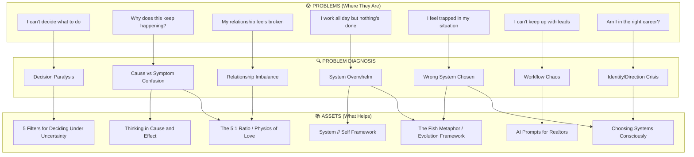

# Problem-First Content Mapping
## Meeting the Audience Where They Are — In the Pain, Not the Store

---

## The Principle

**People don't search for solutions. They search for relief from problems.**

They're not typing "5 filters for decision making" — they're typing:
- "I can't decide what to do"
- "How do I know if this is the right choice"
- "I keep going back and forth"

**Problem diagnostics is the most important work.** Nothing worse than solving the wrong problem.

---

## Problem Prompts → Asset Mapping

### UNCERTAINTY & DECISION-MAKING

| Problem Prompt (What They Search/Feel) | Asset | Type |
|----------------------------------------|-------|------|
| "I can't decide what to do" | 5 Filters for Deciding Under Uncertainty | Post |
| "How do I know if this is the right choice?" | 5 Filters for Deciding Under Uncertainty | Post |
| "I keep going back and forth on this decision" | 5 Filters for Deciding Under Uncertainty | Post |
| "What if I make the wrong choice?" | 5 Filters for Deciding Under Uncertainty | Post |
| "I'm paralyzed by too many options" | 5 Filters for Deciding Under Uncertainty | Post |
| "How do I decide when I don't have all the information?" | 5 Filters for Deciding Under Uncertainty | Post |

---

### RELATIONSHIP PROBLEMS

| Problem Prompt (What They Search/Feel) | Asset | Type |
|----------------------------------------|-------|------|
| "Why does my partner always seem upset with me?" | The 5:1 Ratio / Physics of Love | Post |
| "We fight about the same things over and over" | Thinking in Cause and Effect | Post |
| "I feel like I'm doing everything right but it's not working" | The 5:1 Ratio | Post |
| "How do I know if my relationship is healthy?" | The 5:1 Ratio | Post |
| "We've lost the spark" | The Physics of Love | Post |
| "Why do small things turn into big fights?" | Thinking in Cause and Effect | Post |
| "I don't understand what my partner actually needs" | The Physics of Love | Post |

---

### CAUSE & EFFECT CONFUSION

| Problem Prompt (What They Search/Feel) | Asset | Type |
|----------------------------------------|-------|------|
| "I keep trying things but nothing works" | Thinking in Cause and Effect | Post |
| "Why does this keep happening to me?" | Thinking in Cause and Effect | Post |
| "I fixed the problem but it came back" | Thinking in Cause and Effect | Post |
| "I can't figure out what's causing this" | Thinking in Cause and Effect | Post |
| "Am I treating the symptom or the disease?" | Thinking in Cause and Effect | Post |
| "How do I find the root cause?" | Thinking in Cause and Effect | Post |

---

### FEELING STUCK / OVERWHELMED

| Problem Prompt (What They Search/Feel) | Asset | Type |
|----------------------------------------|-------|------|
| "I work all day but nothing feels done" | System // Self Framework | Framework |
| "I'm busy but not productive" | System // Self Framework | Framework |
| "I feel like I'm drowning in tasks" | System // Self Framework | Framework |
| "I can't get ahead no matter how hard I try" | The Fish Metaphor / Evolution Framework | Framework |
| "I'm doing what I'm supposed to but it's not working" | Choosing Systems Consciously | Framework |
| "I feel trapped in my situation" | The Fish Metaphor | Framework |

---

### REALTOR-SPECIFIC PROBLEMS

| Problem Prompt (What They Search/Feel) | Asset | Type |
|----------------------------------------|-------|------|
| "I can't keep up with all my leads" | AI Prompts for Realtors | Product |
| "I spend all my time on admin, not selling" | AI Prompts for Realtors | Product |
| "My listings don't stand out" | AI Prompts for Realtors | Product |
| "I work 7 days a week and still feel behind" | Realtor Discovery Framework | Framework |
| "How do I know which leads are worth my time?" | Realtor Discovery Framework | Framework |
| "I hate writing listing descriptions" | AI Prompts for Realtors | Product |

---

### CAREER / LIFE DIRECTION

| Problem Prompt (What They Search/Feel) | Asset | Type |
|----------------------------------------|-------|------|
| "Am I in the right career?" | Choosing Systems Consciously | Framework |
| "I'm successful but not fulfilled" | The Fish Metaphor | Framework |
| "I followed the path but I'm not happy" | "The game is the problem, not the dice" | Framework |
| "I feel like I'm living someone else's life" | Seeing the Water You're Swimming In | Framework |
| "What should I do with my life?" | Evolution Framework (Kelp to Cosmos) | Framework |
| "How do I know what I really want?" | 5 Filters + Self Reflection | Post + Framework |

---

### AI / TECHNOLOGY ANXIETY

| Problem Prompt (What They Search/Feel) | Asset | Type |
|----------------------------------------|-------|------|
| "Will AI replace my job?" | What I'm Building | Post |
| "I don't understand how to use AI" | AI Prompts for Realtors (example of practical AI) | Product |
| "Everyone's talking about AI but I feel left behind" | AI Agent Architecture | Post |
| "How do I use AI without losing my humanity?" | System // Self Framework | Framework |
| "I'm afraid of being automated away" | The Surfer Metaphor (ride the wave) | Framework |

---

## Mermaid Diagram: Problem → Asset Flow



---

## Structured Table: Complete Asset Inventory

| Asset | Type | Primary Problem It Solves | Problem Prompts That Lead Here |
|-------|------|---------------------------|--------------------------------|
| **5 Filters for Deciding Under Uncertainty** | Post | Decision paralysis under incomplete information | "I can't decide", "What if I'm wrong?", "Too many options" |
| **Thinking in Cause and Effect** | Post | Treating symptoms instead of causes | "Why does this keep happening?", "I fixed it but it came back" |
| **The Physics of Love** | Post | Relationship confusion, loss of connection | "We've lost the spark", "I don't understand what they need" |
| **The 5:1 Ratio** | Post | Relationship imbalance, chronic conflict | "We fight about the same things", "Nothing I do is enough" |
| **What I'm Building** | Post | AI anxiety, future uncertainty | "Will AI replace me?", "I feel left behind" |
| **AI Agent Architecture** | Post | Technical curiosity, building with AI | "How do AI systems actually work?" |
| **AI Video Editing Tools** | Post | Content creation overwhelm | "Video editing takes too long" |
| **System // Self Framework** | Framework | Overwhelm, busy-but-not-productive | "I work all day but nothing's done", "I'm drowning" |
| **The Fish Metaphor** | Framework | Feeling trapped, wrong life path | "I feel stuck", "This isn't my life" |
| **Evolution Framework (Kelp to Cosmos)** | Framework | Direction crisis, meaning search | "What should I do with my life?" |
| **Choosing Systems Consciously** | Framework | Wrong systems, misaligned life | "I followed the path but I'm not happy" |
| **Realtor Discovery Framework** | Framework | Realtor workflow chaos | "I can't keep up", "I work 7 days a week" |
| **AI Prompts for Realtors** | Product | Realtor content/admin burden | "I hate writing descriptions", "Listings don't stand out" |

---

## Problem-First Content Titles (Rewrites)

### Current (Solution-Centric) → Proposed (Problem-Centric)

| Current Title | Problem-First Alternative |
|---------------|---------------------------|
| 5 Filters for Deciding Under Uncertainty | "I Can't Decide": A Framework for When You Don't Have All the Answers |
| Thinking in Cause and Effect | Why Does This Keep Happening? Finding the Real Problem |
| The Physics of Love | What's Actually Wrong With My Relationship? The Science Nobody Taught You |
| The 5:1 Ratio | We Keep Fighting About the Same Things: The Math Behind Healthy Relationships |
| What I'm Building | Am I Going to Be Replaced? What I Learned Building AI Systems |
| System // Self | I Work All Day But Nothing's Done: The Infrastructure of a Life That Works |
| AI Prompts for Realtors | I Hate Writing Listing Descriptions: AI That Actually Helps |

---

## The Problem Diagnostic Process

```
1. SYMPTOM: What they feel/search
   ↓
2. DIAGNOSIS: What's actually happening
   ↓
3. ROOT CAUSE: The system/pattern causing it
   ↓
4. FRAMEWORK: The lens to see it clearly
   ↓
5. ACTION: What to do about it
```

**This is the value:** Not just solving problems, but helping people **understand what their problem actually is.**

---

## Next Steps

1. **Audit current content** — Are titles problem-first or solution-first?
2. **Create problem prompt lists** — What would someone type into Google when feeling this pain?
3. **Map SEO keywords** — Actual search volume for problem phrases
4. **Rewrite headlines** — Lead with the pain, not the cure
5. **Build diagnostic tools** — Quiz/assessment that helps identify their actual problem

---

## The Mantra

> **"My tools know what problems they're solving."**

Every piece of content should be findable by someone in pain, not someone shopping for solutions.

Meet them in the suffering. Diagnose accurately. Then offer the path forward.

---

## Market Research Validation (Search Evidence)

### Validated Problem Phrases (People Actually Search These)

**"I can't decide"** — r/findapath, r/careeradvice active discussions
- "I really need to pick a career path but I can't decide"
- "Current job is counteroffering me, I can't decide what to do"

**"Why does this keep happening"** — Psychology Today, YouTube content
- "Why does this keep happening to me?" (exact phrase used)
- Content about repeating relationship patterns gets engagement

**"I feel stuck"** — Quora, Reddit, BetterUp, Tony Robbins content
- "I'm 28 years old and I feel stuck in my life especially career wise"
- "I feel stuck and miserable in my current job"
- "Why do I feel stuck in life?" (exact question)
- Major search volume indicator: Multiple high-authority sites have content for this phrase

**"Work all day nothing gets done"** — Blog Marketing Academy
- "The Reason Why You Work All Day And Nothing Gets Done" (article title)
- "You're working but getting nothing done" (the pain articulated)

### Implications for Content Strategy

1. **Use exact problem phrases in titles** — These are what people type
2. **Create content that shows up for pain searches** — Not solution searches
3. **Diagnostic framing works** — "Why does this keep happening?" implies need to understand root cause
4. **Age/stage specificity helps** — "I'm 28 and stuck" shows demographic targeting opportunities
