# User Flow: Tools & Assessment Experience

This diagram shows every forward path a user can take from the main content page through the tools and assessment experience to completion states.

```mermaid
flowchart TB
    %% Entry Points
    HOME[/"🏠 Home Page<br>(index.html)"/]
    
    %% Primary CTAs from Home
    HOME -->|"Hero CTA:<br>'What kind of AI user are you?'"| QUIZ
    HOME -->|"Tools Card"| TOOLS_INDEX
    HOME -->|"Frameworks Card"| FRAMEWORKS_INDEX
    
    %% Tools Index
    TOOLS_INDEX[/"🛠️ Tools Index<br>(/tools/)"/]
    
    %% From Tools Index - Assessments
    TOOLS_INDEX -->|"AI User Type Quiz"| QUIZ
    TOOLS_INDEX -->|"AI Usage Behavior Profile"| ADV_ASSESS
    TOOLS_INDEX -->|"Problem Audit Worksheet"| PROBLEM_AUDIT
    TOOLS_INDEX -->|"5 Filters Assessment"| FIVE_FILTERS
    
    %% From Tools Index - Utilities
    TOOLS_INDEX -->|"Script Reader"| SCRIPT_READER
    
    %% From Tools Index - Wisdom Tools
    TOOLS_INDEX -->|"The Free Time Tool"| FREE_HOUR
    TOOLS_INDEX -->|"The Hour Apart"| HOUR_APART
    
    %% ═══════════════════════════════════════════
    %% AI USER QUIZ FLOW (5 questions → results)
    %% ═══════════════════════════════════════════
    
    subgraph QUIZ_FLOW ["AI User Type Quiz"]
        QUIZ[/"🎯 Quiz Start<br>(ai-user-quiz.html)"/]
        Q1["Q1: When I open an AI tool...<br>Exploring vs Building"]
        Q2["Q2: In my current work...<br>Investigating vs Executing"]
        Q3["Q3: I want AI to help me...<br>Expand vs Focus"]
        Q4["Q4: When working with AI...<br>Discover vs Decide"]
        Q5["Q5: Validator Question<br>Most satisfying outcome"]
        QUIZ_RESULTS["📊 Quiz Results<br>(inline display)"]
        
        QUIZ --> Q1 --> Q2 --> Q3 --> Q4 --> Q5 --> QUIZ_RESULTS
    end
    
    QUIZ_RESULTS -->|"View Deep Dive →"| DEEP_DIVE
    
    %% ═══════════════════════════════════════════
    %% ADVANCED ASSESSMENT FLOW
    %% ═══════════════════════════════════════════
    
    subgraph ADV_FLOW ["Advanced AI Usage Assessment"]
        ADV_ASSESS[/"🔬 Advanced Assessment<br>(/frameworks/ai-usage-advanced.html)"/]
        ADV_Q1["Q1-8: Behavioral Questions"]
        ADV_RESULTS["📈 Results with Bar Chart"]
        
        ADV_ASSESS --> ADV_Q1 --> ADV_RESULTS
    end
    
    ADV_RESULTS -->|"View Deep Dive"| DEEP_DIVE
    
    %% Deep Dive Destination
    DEEP_DIVE[/"🔍 AI Profile Deep Dive<br>(/frameworks/ai-usage-advanced-deepdive.html)"/]
    
    %% ═══════════════════════════════════════════
    %% THE FREE TIME TOOL FLOW
    %% ═══════════════════════════════════════════
    
    subgraph FREE_FLOW ["The Free Time Tool"]
        FREE_HOUR[/"⏳ Free Time Start<br>(/tools/free-hour.html)"/]
        FREE_S1["Step 1: Context Input<br>• Time available (15-180 min)<br>• Situation description"]
        FREE_S2["Step 2: Question Selection<br>8 Philosophy Cards"]
        FREE_S3["Step 3: Philosophy Detail<br>Thinking + Prompt"]
        
        FREE_HOUR --> FREE_S1
        FREE_S1 -->|"Show Me Approaches →"| FREE_S2
        FREE_S2 -->|"Select a question"| FREE_S3
    end
    
    %% Philosophy Cards (expanded)
    subgraph PHILOSOPHY_CARDS ["8 Philosophy Approaches"]
        P1["Virtue Ethics<br>'What would a flourishing person do?'"]
        P2["Stoicism<br>'What's within my control?'"]
        P3["Taoism<br>'Where can I stop forcing?'"]
        P4["Buddhist<br>'What matters most right now?'"]
        P5["Utilitarianism<br>'What creates the most good?'"]
        P6["Kant<br>'What if no one were watching?'"]
        P7["Existentialism<br>'What would I be proud of later?'"]
        P8["Pragmatism<br>'What's the simplest thing that might work?'"]
    end
    
    FREE_S2 --> P1 & P2 & P3 & P4 & P5 & P6 & P7 & P8
    P1 & P2 & P3 & P4 & P5 & P6 & P7 & P8 --> FREE_S3
    
    FREE_S3 -->|"Start My Hour →"| HOUR_APART
    FREE_S3 -->|"Read the Story →"| STORY_PAGE
    
    STORY_PAGE[/"📖 Philosophy of Not Scrolling<br>(/wisdom/philosophy-of-not-scrolling.html)"/]
    
    %% ═══════════════════════════════════════════
    %% THE HOUR APART FLOW
    %% ═══════════════════════════════════════════
    
    subgraph HOUR_FLOW ["The Hour Apart"]
        HOUR_APART[/"🔮 Hour Apart Start<br>(/tools/philosophy-lab.html)"/]
        
        HA_S1["Step 1: Select Type"]
        HA_S2["Step 2: Select Philosophy Lens<br>(3 options per type)"]
        HA_S3["Step 3: Mission + Timer"]
        HA_S4["Step 4: Reflection Form"]
        HA_S5["Step 5: Completion"]
        
        HOUR_APART --> HA_S1
    end
    
    %% Type Selection
    subgraph TYPE_SELECT ["User Type Selection"]
        T_EXPLORER["🔭 The Explorer<br>'Depth over breadth'"]
        T_ANALYST["🔬 The Analyst<br>'Action over perfection'"]
        T_DESIGNER["🎨 The Designer<br>'Execution over vision'"]
        T_BUILDER["🔨 The Builder<br>'Reflection over action'"]
    end
    
    HA_S1 --> T_EXPLORER & T_ANALYST & T_DESIGNER & T_BUILDER
    T_EXPLORER & T_ANALYST & T_DESIGNER & T_BUILDER -->|"Continue"| HA_S2
    
    %% Philosophy Selection per Type (simplified)
    HA_S2 -->|"Select lens"| HA_S3
    
    %% Timer Actions
    HA_S3 -->|"Start Timer"| TIMER_RUNNING["⏱️ Timer Running<br>(up to 60 min)"]
    TIMER_RUNNING -->|"Timer Complete"| HA_S4
    TIMER_RUNNING -->|"I'm Back"| HA_S4
    
    HA_S4 -->|"Complete Lab"| HA_S5
    
    %% Completion CTAs
    HA_S5 -->|"Take the Full Quiz"| QUIZ
    HA_S5 -->|"Try Again"| HOUR_APART
    
    %% ═══════════════════════════════════════════
    %% OTHER FRAMEWORK TOOLS
    %% ═══════════════════════════════════════════
    
    FRAMEWORKS_INDEX[/"◫ Frameworks Index<br>(/frameworks/)"/]
    
    subgraph OTHER_TOOLS ["Other Framework Tools"]
        PROBLEM_AUDIT[/"🔍 Problem Audit<br>5-step worksheet"/]
        FIVE_FILTERS[/"◫ 5 Filters<br>Decision assessment"/]
        SCRIPT_READER[/"📜 Script Reader<br>Teleprompter utility"/]
    end
    
    PROBLEM_AUDIT --> PROBLEM_COMPLETE["✅ Report Generated"]
    FIVE_FILTERS --> FILTER_COMPLETE["✅ Verdict + Recommendation"]
    SCRIPT_READER --> SCRIPT_ACTIVE["📺 Teleprompter Active"]
    
    %% ═══════════════════════════════════════════
    %% TERMINAL STATES (Completion Points)
    %% ═══════════════════════════════════════════
    
    subgraph COMPLETIONS ["🏁 Completion States"]
        DEEP_DIVE
        STORY_PAGE
        HA_S5
        PROBLEM_COMPLETE
        FILTER_COMPLETE
        SCRIPT_ACTIVE
    end
    
    %% Styling
    classDef entry fill:#faf6f1,stroke:#c9a227,stroke-width:3px
    classDef quiz fill:#dbeafe,stroke:#1e40af
    classDef wisdom fill:#fce7f3,stroke:#9d174d
    classDef framework fill:#d1fae5,stroke:#065f46
    classDef complete fill:#f0fdf4,stroke:#15803d,stroke-width:2px
    
    class HOME,TOOLS_INDEX,FRAMEWORKS_INDEX entry
    class QUIZ,Q1,Q2,Q3,Q4,Q5,QUIZ_RESULTS,ADV_ASSESS,ADV_Q1,ADV_RESULTS,DEEP_DIVE quiz
    class FREE_HOUR,FREE_S1,FREE_S2,FREE_S3,HOUR_APART,HA_S1,HA_S2,HA_S3,HA_S4,HA_S5,TIMER_RUNNING wisdom
    class PROBLEM_AUDIT,FIVE_FILTERS,SCRIPT_READER framework
    class PROBLEM_COMPLETE,FILTER_COMPLETE,SCRIPT_ACTIVE,STORY_PAGE complete
```



## Key Pathways

### Path A: Quick Assessment
```
Home → AI User Quiz → 5 Questions → Results → Deep Dive
```

### Path B: Behavioral Assessment
```
Home → Tools → AI Usage Behavior Profile → 8 Questions → Results → Deep Dive
```

### Path C: Free Time to Wisdom
```
Home → Tools → The Free Time Tool → Context → Philosophy Card → Detail → The Hour Apart
```

### Path D: Direct Hour Apart
```
Home → Tools → The Hour Apart → Type Select → Philosophy → Timer → Reflection → Complete
```

### Path E: Decision Framework
```
Home → Tools → 5 Filters Assessment → Decision Entry → Verdict
```

## Notes

- **Quiz v1/v2/v3**: Multiple versions exist in `/tools/` - the home page links to `ai-user-quiz.html` (v1), tools index also links to v1
- **Broken link**: Hour Apart completion "Take the Full Quiz" button has no href
- **Cross-links**: Free Hour flows into Hour Apart via "Start My Hour"
- **State persistence**: Both Free Hour and Hour Apart use localStorage to persist progress
