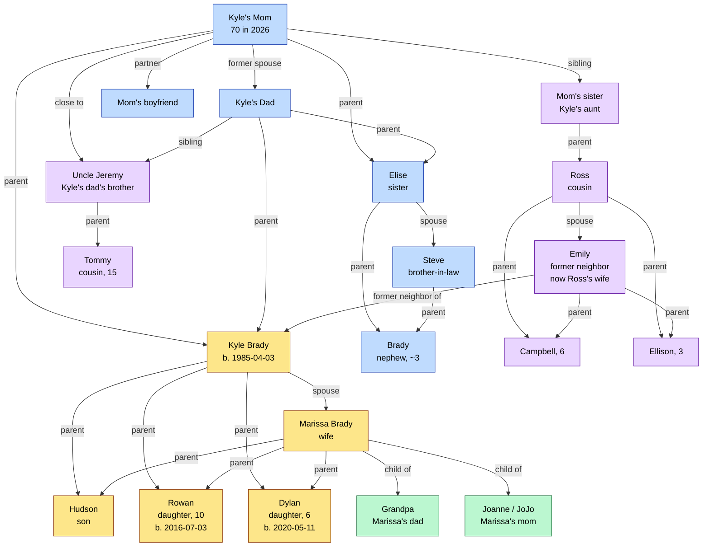

# Relationship Knowledge Graph

Visual map of Kyle's people network. Edit as people are added/discovered.

## Family Graph (Mermaid)

## Key Insights

### Kyle as Connective Tissue
- Ross + Emily met at Kyle's house (Emily was his next-door neighbor)
- They connected at Kyle's wedding
- Now married with 2 kids
- Pattern: Kyle's spaces and events create relationships that outlast the original moment

### Cross-Divorce Continuity
- Kyle's parents are divorced
- Kyle's mom remains very close with Uncle Jeremy (Kyle's dad's brother) and his family
- This works smoothly — children/grandchildren see both sides without conflict
- Pattern: Relationships maintained through deliberate choice, not obligation

### Three-Generation Hosting
- Kyle and Marissa frequently host multi-family, multi-generational gatherings
- LBI 2026: Mom (70) + Marissa's dad (Grandpa) + siblings + cousins + cousins' kids
- They're not attending family events — they're *building the infrastructure* for them

## Next To Add
- Marissa's siblings (if any)
- Hudson's birthday / age
- Kyle's wider friend circle
- Bloomberg / professional network
- Kai Hamil collaborators
